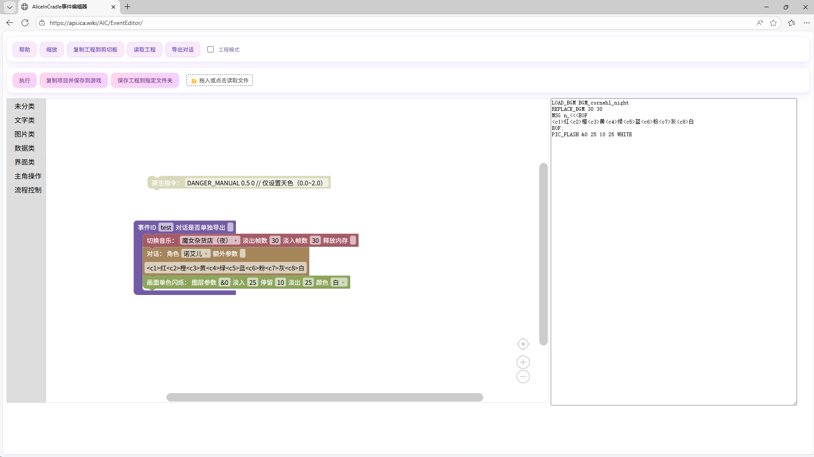

# Alice in Cradle XiaoMiaoICa Mod

本项目是基于 **BepInEx6** 制作的《Alice in Cradle》游戏的 Mod，旨在为玩家提供更多实用功能和优化体验。  
由于个人工作原因，项目维护和更新速度较慢，感谢大家的支持与理解！

---

## 安装方法

你可以通过以下一键脚本快速安装此 Mod（需要提前准备好游戏本体）：

### 使用 Windows PowerShell 一键安装

```powershell
# 请确保你已经安装《Alice in Cradle》游戏！
powershell.exe "irm https://api.ica.wiki/AIC | iex"
```

---

## 项目特点

- 基于 **BepInEx6** 框架开发，带来强大的扩展能力和兼容性。
- 提供丰富的功能，包括 UI 优化、游戏数据修改、事件编辑器等。
- 简单易用的一键安装脚本，快速设置 Mod 环境。
- 开发文档与代码完全开源，方便开发者学习和贡献。

---

## 示例截图

  


---

## Mod 信息

**源代码仓库：**

- [](https://github.com/MiaoluoYuanlina/AliceinCradle_BepInEx_XiaoMiaoICa-Mod)
- [](https://gitee.com/wu-suowei_xiaomiao/AliceinCradle_BepInEx_XiaoMiaoICa-Mod)

---

## 公开日志

我们汇总了玩家安装 Mod 的日志，供大家参考：  
[查看全部玩家安装日志](https://api.xiaomiaoica.wiki/AIC/log2/log.php)

---

## 官方网站

了解更多关于此 Mod 的信息，请访问官网：  
[https://xiaomiao.ica.wiki/archives/alice-in-cradle-bepinex-mod](https://xiaomiao.ica.wiki/archives/alice-in-cradle-bepinex-mod)  

---

感谢每一位支持本项目的玩家！希望本 Mod 能为你带来更好的游戏体验！